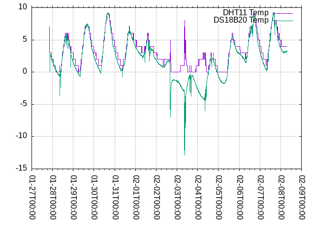

# Raspberry Pi Temperature and Humidity Collection

## DHT11 is rubbish

DHT11 is unsuitable for use.

DHT11s have a nominal temperature sensing range
of 0-50C, with an accuracy of +/- 2C.
That's just too coarse to be of any use.

It has incomprehensible documentation about
what data it returns.
Theoretically, it returns 2 bytes of relative humidity,
and 2 bytes of temperature.
One byte is the "integral part"
and one byte is the "decimal part".
What in tarnation does "decimal part" mean?
An 8-bit byte can have 256 possible values.
Does a "decimal part" byte with a value of "00000001"
mean 0.00000001 degrees, or 0.1 degrees?
What about a "decimal part" of "111110000"?
Is that 0.240 degrees or 0.8571 degrees,
or something else?
All DHT11 data sheets repeat this gibberish.

The interface is a weird serial-like
protocol that is at the very least prone to misreading.
Code to communicate with a DHT11 has to handle
regular checksum errors and read timeouts.
Most code resorts to a form of user space "bit-banging".

Notice the "mirror image" temperatures
from 2022-02-02T12:00:00 to 2022-02-04T12:00:00.
The ambient weather was a cold snap, with daily high
temperatures of approximately 15F,
well below 0C.

The sudden negative excursions of the DS18B20
temperature are from opening the garage door,
letting in very cold outside air.
The DHT11 temperature "mirrors" the DS18B20,
except it returns positive values.

The manufacturers of this particular DHT11 chose
to cripple a more-functional chip by cutting off
the sign bit.
The hardware can sense and report below-zero temperatures,
but without a sign bit,
those values are worse than useless, they're damaging.

## Build and Run

### Server

### Collector
